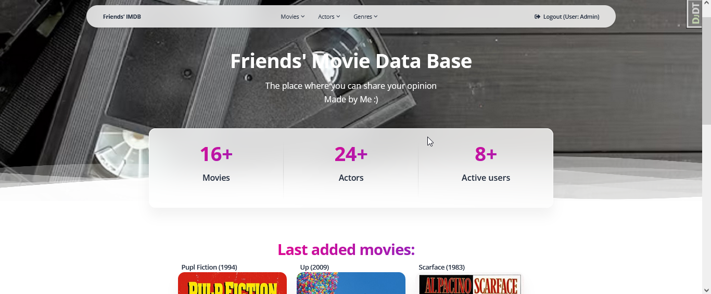

# Friends' IMDB Project 

Django project for managing movies and authors, 
also you can see movie ratings from other users & 
give your own evaluations for watched movies.

## Try it!

Here must be link

## Installation

Python 3 should be installed

git clone https://github.com/rakamakaphone/friends-imdb
cd friends-imdb
python -m venv venv
source venv\Scripts\activate
pip install -r requirements.txt
python manage.py runserver

## Features

1. Admin panel for advanced managing
2. Authentication functionality for User
3. Managing Movies and Actors on website
4. Film evaluation.

## Demo

